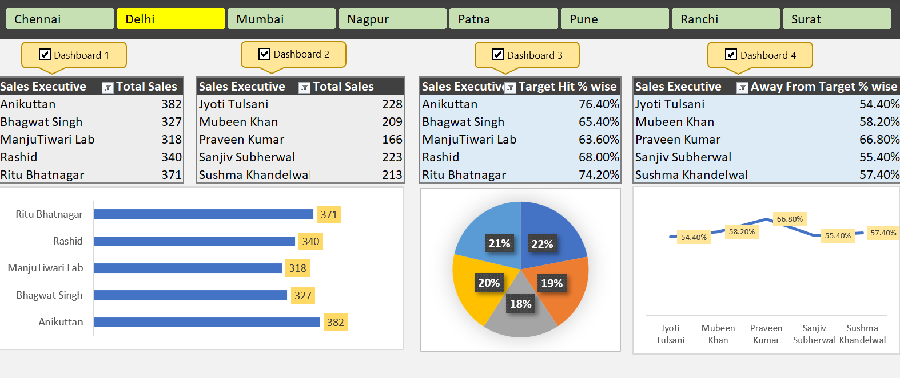
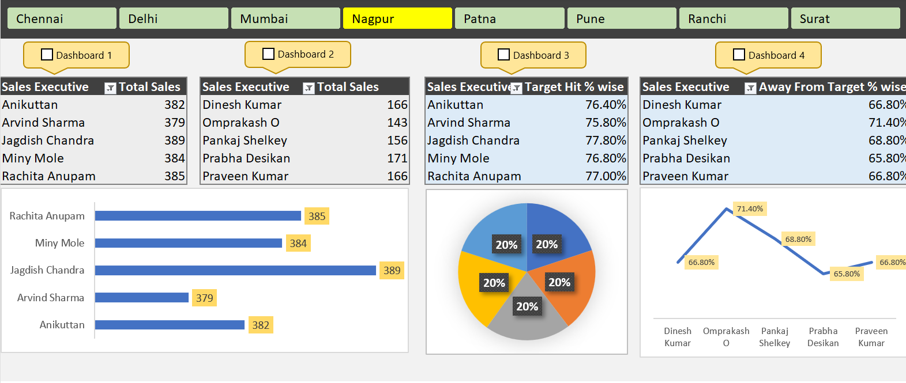

# 📊 Excel Sales Performance Dashboard with Macros

> 📈 A comprehensive Excel dashboard project that visualizes sales performance, target achievements, and team efficiency across multiple cities — powered by **charts, pivot tables, slicers**, and **recorded macros** for automation.

---

## 👨‍💻 Developed by: **Harshit Kumar**

🎓 Final-Year Undergraduate | 💼 Data Analyst | 🧠 Excel • VBA Macros • Dashboards  
📍 NIT Patna | 📬 harshitk.nitp@gmail.com  
🔗 [LinkedIn](https://www.linkedin.com/in/harshit-kumar-32bbb7271)

---

## 🧩 Project Overview

This Excel project presents a **multi-city sales dashboard** that tracks the performance of Sales Executives in cities like **Delhi, Nagpur, Chennai, Patna, Pune, Ranchi, Surat, and more**. It includes:

- 📈 Total sales tracking
- 🎯 Target hit % analysis
- 📉 Away from target % reporting
- 🔁 Macro automation for dashboard navigation

---

## 🖼️ Dashboard Preview

### 📍 Delhi Dashboard View

### 📍 Nagpur Dashboard View

> *Each city tab is interactive and switchable. Macro-enabled buttons streamline dashboard selection.*

---

## 🛠️ Tools & Techniques Used

- 🧮 **Pivot Tables & Pivot Charts**
- 🖼️ **Bar, Pie, and Line Charts**
- 🧠 **VBA Macros** for switching dashboards and toggling filters
- 🖱️ **Slicers** for dynamic region selection
- 🎨 **Conditional Formatting** for visual emphasis

---

## 📊 Key Dashboards & Metrics

### ✅ Dashboard 1
- Sales Executive vs Total Sales Table
- Horizontal Bar Chart for Top Performers

### ✅ Dashboard 2
- Another sales team or region (varies by city)
- Tabulated Sales Metrics

### ✅ Dashboard 3
- **Target Hit % wise** comparison
- Pie Chart for visual distribution

### ✅ Dashboard 4
- **Away From Target %** view
- Line chart showing underperformers

---

## 📁 File Contents

| File Name     | Description                                 |
|---------------|---------------------------------------------|
| `Excel1.png`  | Screenshot of Delhi dashboard               |
| `Excel2.png`  | Screenshot of Nagpur dashboard              |
| `README.md`   | GitHub documentation (this file)            |
| `Excel Project.xlsm file`  | Contains data , macros and dashboards|

---

## 💡 Features & Learnings

- 🧩 Created modular dashboards for each city using slicers & pivot tables
- 🧠 Learned **macro recording** and basic **VBA automation**
- 🔍 Compared real vs target sales across teams
- 🎯 Used **conditional formatting** for live performance insights
- 💾 Used `.xlsm` format to enable **macro-powered interactivity**

---

## 🚀 Future Enhancements

- 🖇️ Connect Excel to **Power Query** for real-time data refresh  
- 📤 Export reports via macro email automation  
- 📱 Make responsive for mobile via Power BI integration  
- 🌐 Upload macro-driven dashboard as web app using Excel Online  

---

> ⭐ *If you find this project useful or inspiring, consider giving it a star!*  
> 💬 Feedback and collaboration inquiries are welcome.

